# System Architecture & Design Document
## Restaurant Digital Menu SaaS Platform

**Version:** 1.0  
**Date:** 2024  
**Status:** MVP Architecture  
**Author:** Solution Architect

---

## 📑 Table of Contents

1. [Executive Summary](#1-executive-summary)
2. [System Architecture](#2-system-architecture)
3. [Component Architecture](#3-component-architecture)
4. [Data Architecture](#4-data-architecture)
5. [API Architecture](#5-api-architecture)
6. [Security Architecture](#6-security-architecture)
7. [Deployment Architecture](#7-deployment-architecture)
8. [Key Design Patterns](#8-key-design-patterns)
9. [Technology Stack](#9-technology-stack)
10. [Scalability & Performance](#10-scalability--performance)

---

## 1. Executive Summary

This document describes the architecture for a **multi-tenant SaaS platform** that enables restaurants to manage digital menus. The system follows industry best practices while maintaining simplicity for MVP delivery.

### Architecture Principles
- **Multi-tenant SaaS** with shared database model
- **RESTful API** design with JWT authentication
- **Microservices-ready** but monolithic for MVP
- **Cloud-native** deployment (Docker, managed services)
- **Security-first** approach with tenant isolation
- **Scalable** foundation for future growth

---

## 2. System Architecture

### 2.1 High-Level System Architecture

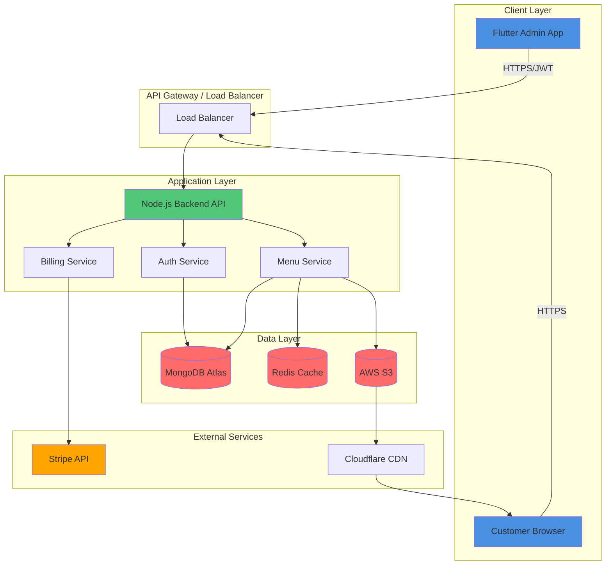

### 2.2 Request Flow Architecture

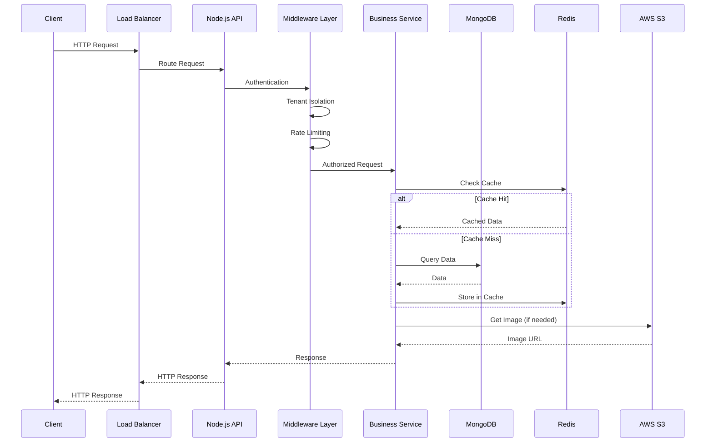

---

## 3. Component Architecture

### 3.1 Backend Component Structure

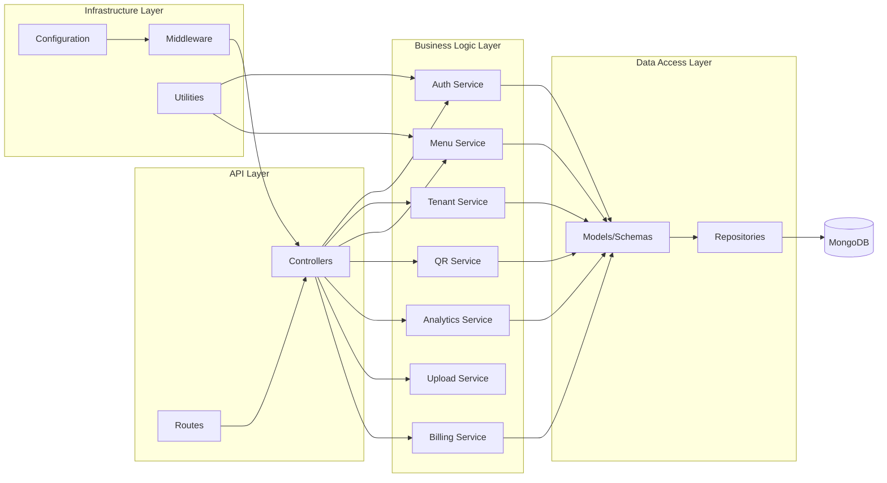

### 3.2 Detailed Component Responsibilities

| Component | Responsibility |
|-----------|---------------|
| **Routes** | Define API endpoints, HTTP methods |
| **Controllers** | Handle HTTP requests/responses, validation |
| **Services** | Business logic, orchestration |
| **Models** | Data schemas, validation rules |
| **Repositories** | Database operations, queries |
| **Middleware** | Auth, tenant isolation, rate limiting, logging |
| **Utils** | Helpers, formatters, validators |

---

## 4. Data Architecture

### 4.1 Multi-Tenant Data Model

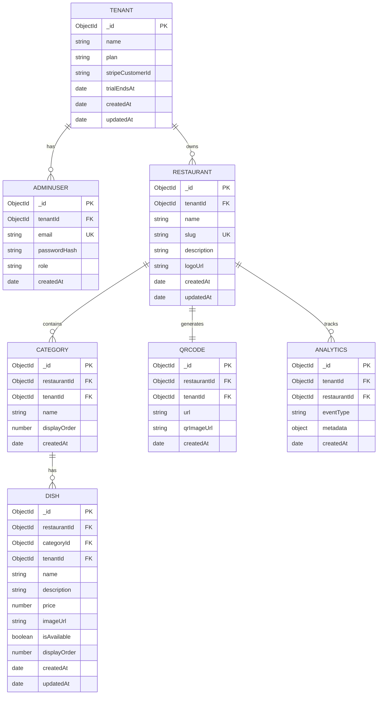

### 4.2 Database Indexing Strategy

```javascript
// Critical Indexes for Performance
tenants: []
adminUsers: [
  { email: 1 }, // unique
  { tenantId: 1 }
]
restaurants: [
  { slug: 1 }, // unique
  { tenantId: 1 }
]
categories: [
  { restaurantId: 1, displayOrder: 1 },
  { tenantId: 1 }
]
dishes: [
  { restaurantId: 1, categoryId: 1, displayOrder: 1 },
  { tenantId: 1 },
  { isAvailable: 1 }
]
qrCodes: [
  { restaurantId: 1 },
  { tenantId: 1 }
]
analytics: [
  { tenantId: 1, createdAt: -1 },
  { restaurantId: 1, eventType: 1, createdAt: -1 }
]
```

### 4.3 Data Isolation Strategy

**Tenant Isolation Pattern:**
- All queries MUST include `tenantId` filter
- Middleware enforces tenant context from JWT
- No cross-tenant data access possible
- Indexes on `tenantId` for performance

---

## 5. API Architecture

### 5.1 API Design Principles

- **RESTful** conventions
- **Versioned** APIs (`/api/v1/...`)
- **Consistent** response format
- **Error handling** standards
- **Rate limiting** per tenant

### 5.2 API Endpoint Structure

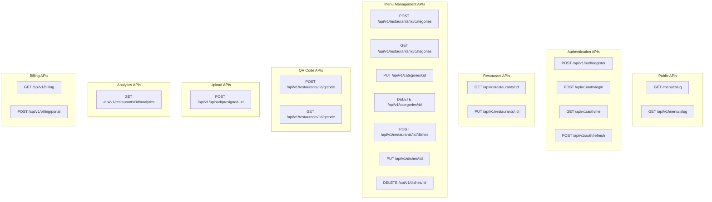

### 5.3 API Response Format

```json
// Success Response
{
  "success": true,
  "data": { ... },
  "message": "Operation successful"
}

// Error Response
{
  "success": false,
  "error": {
    "code": "VALIDATION_ERROR",
    "message": "Invalid input",
    "details": [ ... ]
  }
}
```

---

## 6. Security Architecture

### 6.1 Security Layers

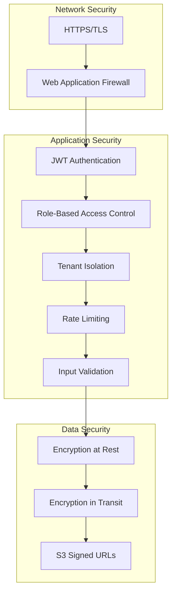

### 6.2 Authentication Flow

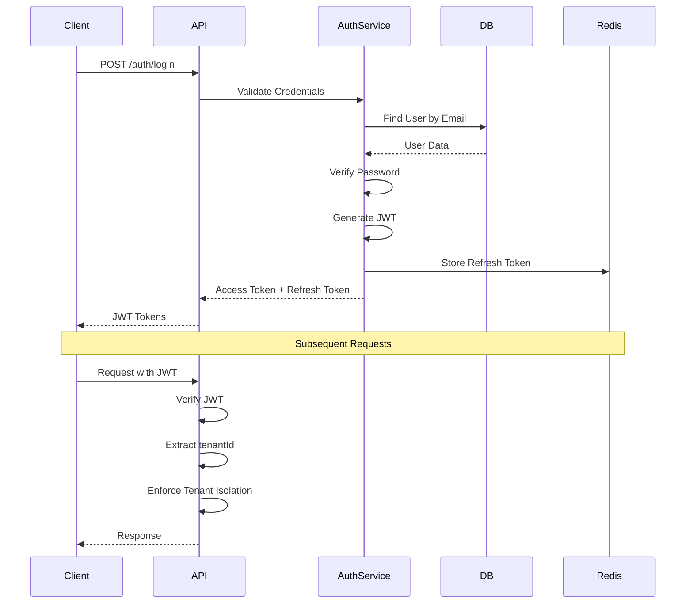

### 6.3 Tenant Isolation Enforcement

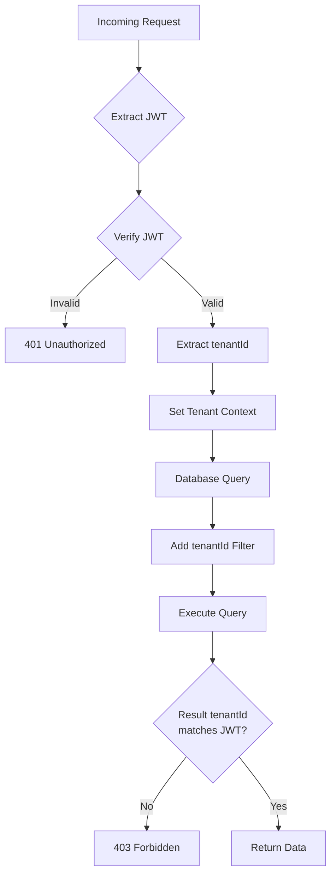

---

## 7. Deployment Architecture

### 7.1 Infrastructure Architecture

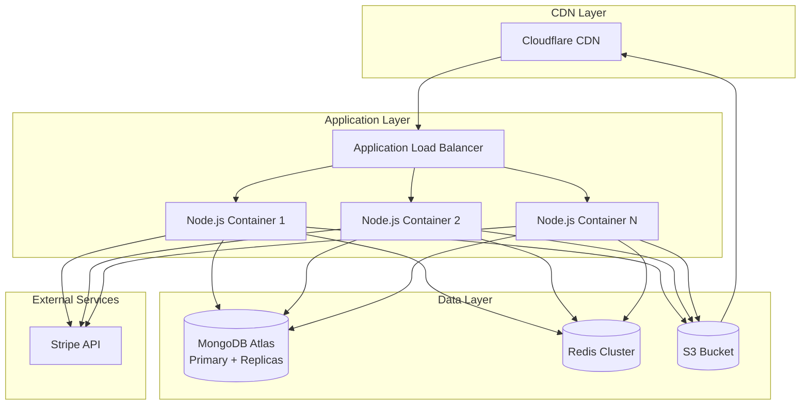

### 7.2 Container Architecture

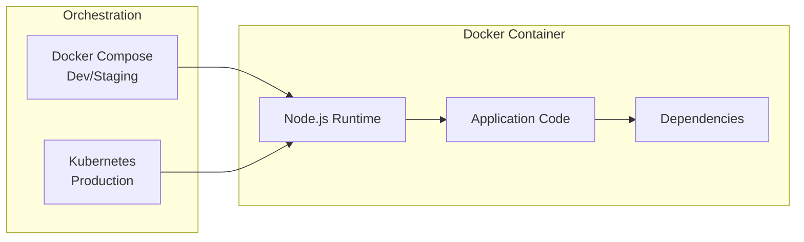

---

## 8. Key Design Patterns

### 8.1 Service Layer Pattern

**Purpose:** Separate business logic from controllers

```javascript
// Controller (Thin)
class DishController {
  async create(req, res) {
    const dish = await dishService.create(req.body, req.tenantId);
    res.json({ success: true, data: dish });
  }
}

// Service (Business Logic)
class DishService {
  async create(data, tenantId) {
    // Validation
    // Business rules
    // Database operations
    // Return result
  }
}
```

### 8.2 Repository Pattern

**Purpose:** Abstract database operations

```javascript
class DishRepository {
  async findByRestaurant(restaurantId, tenantId) {
    return Dish.find({ restaurantId, tenantId });
  }
}
```

### 8.3 Middleware Chain Pattern

**Purpose:** Compose cross-cutting concerns

```javascript
app.use(authenticationMiddleware);
app.use(tenantIsolationMiddleware);
app.use(rateLimitMiddleware);
app.use(validationMiddleware);
```

### 8.4 Feature Flag Pattern

**Purpose:** Plan-based feature access

```javascript
function checkFeature(plan, feature) {
  const planFeatures = PLAN_FEATURES[plan];
  return planFeatures.includes(feature);
}
```

---

## 9. Technology Stack

### 9.1 Backend Stack

| Layer | Technology | Purpose |
|-------|-----------|---------|
| **Runtime** | Node.js 18+ | JavaScript runtime |
| **Framework** | Express.js | Web framework |
| **Database** | MongoDB 6+ | Document database |
| **ODM** | Mongoose | MongoDB object modeling |
| **Cache** | Redis 7+ | Caching layer |
| **Storage** | AWS S3 | Image storage |
| **Authentication** | JWT (jsonwebtoken) | Token-based auth |
| **Validation** | Joi/Zod | Input validation |
| **Logging** | Winston/Pino | Application logging |
| **Testing** | Jest | Unit/integration tests |

### 9.2 Frontend Stack

| Component | Technology | Purpose |
|-----------|-----------|---------|
| **Mobile App** | Flutter | Cross-platform admin app |
| **State Management** | Provider/Riverpod | State management |
| **HTTP Client** | Dio/HTTP | API communication |
| **Storage** | SharedPreferences | Local storage |

### 9.3 Infrastructure Stack

| Component | Technology | Purpose |
|-----------|-----------|---------|
| **Containerization** | Docker | Application containers |
| **Orchestration** | Docker Compose / K8s | Container orchestration |
| **Database** | MongoDB Atlas | Managed MongoDB |
| **Cache** | Redis Cloud / ElastiCache | Managed Redis |
| **CDN** | Cloudflare | Content delivery |
| **Monitoring** | CloudWatch / DataDog | Application monitoring |
| **CI/CD** | GitHub Actions | Continuous integration |

---

## 10. Scalability & Performance

### 10.1 Caching Strategy

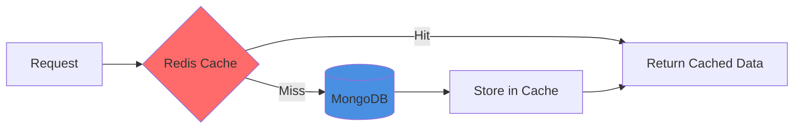

**Cache Keys:**
- Menu data: `menu:{slug}`
- Restaurant: `restaurant:{id}`
- Tenant: `tenant:{id}`

**TTL Strategy:**
- Menu pages: 1 hour (invalidate on update)
- Restaurant data: 30 minutes
- Tenant data: 15 minutes

### 10.2 Performance Optimizations

1. **Database Indexing**
   - All `tenantId` fields indexed
   - Compound indexes for common queries
   - Unique indexes on slugs, emails

2. **Query Optimization**
   - Limit result sets (pagination)
   - Project only needed fields
   - Use aggregation pipelines efficiently

3. **Image Optimization**
   - CDN delivery
   - Multiple sizes (thumbnail, medium, large)
   - WebP format support

4. **API Response Optimization**
   - Gzip compression
   - Response caching headers
   - Pagination for lists

### 10.3 Scalability Plan

**Phase 1 (MVP):**
- Single Node.js instance
- MongoDB Atlas (shared cluster)
- Redis single instance
- Basic monitoring

**Phase 2 (Growth):**
- Horizontal scaling (multiple Node.js instances)
- MongoDB read replicas
- Redis cluster
- Advanced monitoring & alerting

**Phase 3 (Scale):**
- Microservices architecture (if needed)
- Database sharding
- Event-driven architecture
- Advanced analytics pipeline

---

## 11. Key Flows

### 11.1 Tenant Registration Flow

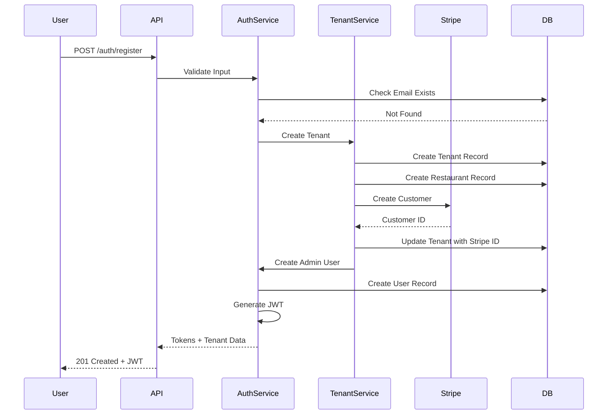

### 11.2 Image Upload Flow

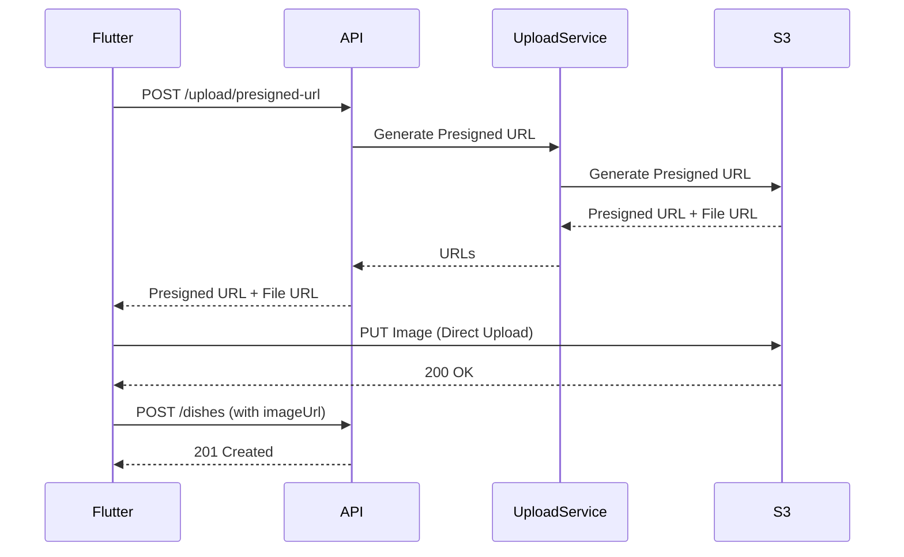

### 11.3 Menu View Flow

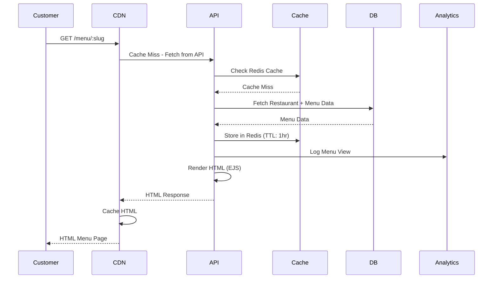

---

## 12. Monitoring & Observability

### 12.1 Key Metrics

- **Application Metrics:**
  - Request rate (RPS)
  - Response time (p50, p95, p99)
  - Error rate
  - Active tenants

- **Database Metrics:**
  - Query performance
  - Connection pool usage
  - Index hit rate

- **Infrastructure Metrics:**
  - CPU/Memory usage
  - Network I/O
  - Disk usage

### 12.2 Logging Strategy

- **Structured Logging:** JSON format
- **Log Levels:** Error, Warn, Info, Debug
- **Log Aggregation:** Centralized logging service
- **Retention:** 30 days

---

## 13. Disaster Recovery

### 13.1 Backup Strategy

- **Database:** MongoDB Atlas automated backups (daily)
- **S3:** Versioning enabled
- **Configuration:** Version controlled in Git

### 13.2 Recovery Procedures

- **RTO (Recovery Time Objective):** < 4 hours
- **RPO (Recovery Point Objective):** < 24 hours
- **Failover:** Manual with automated scripts

---

## 14. Conclusion

This architecture provides a **solid, scalable foundation** for the MVP while maintaining simplicity and avoiding over-engineering. The design follows industry best practices and can evolve as the platform grows.

### Key Strengths
- ✅ Clear separation of concerns
- ✅ Multi-tenant security
- ✅ Scalable infrastructure
- ✅ Industry-standard patterns
- ✅ MVP-focused (not over-engineered)

### Future Enhancements
- Microservices migration (if needed)
- Real-time features (WebSockets)
- Advanced analytics (time-series DB)
- Event-driven architecture
- GraphQL API (optional)

---

**Document Status:** ✅ Approved for Implementation  
**Last Updated:** 2024

