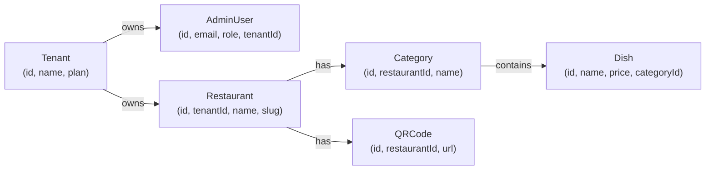
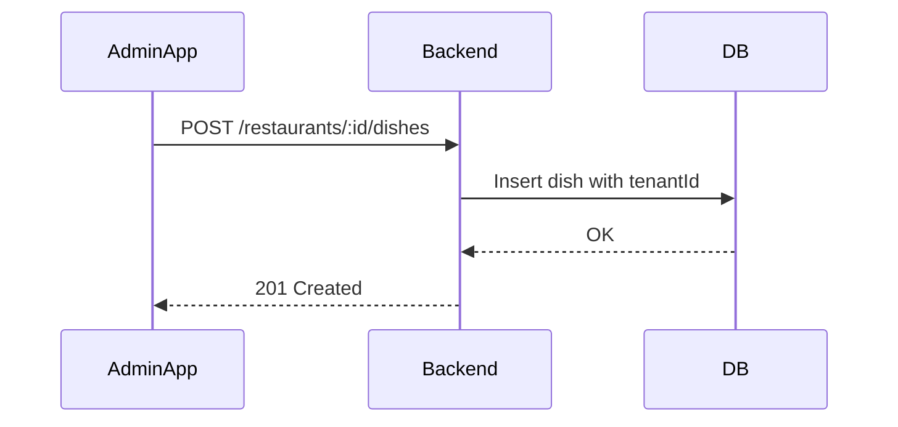
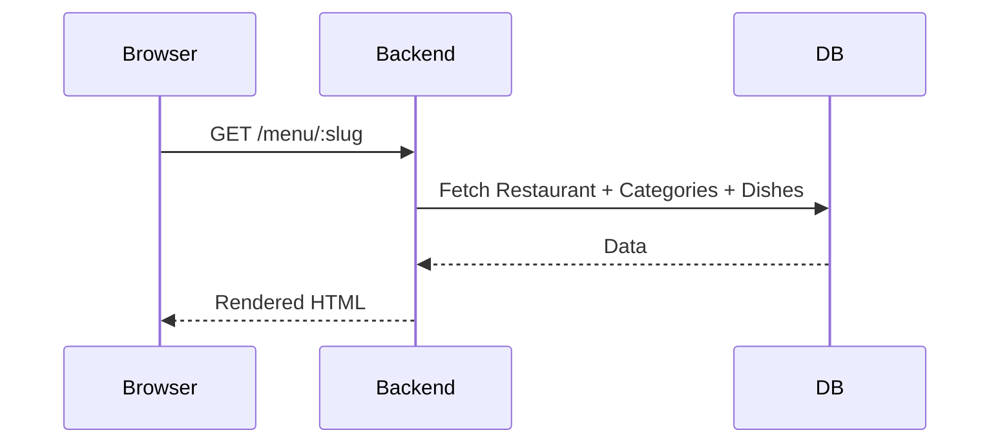

# hospitality-management-system
hospitality-management-system

# Restaurant Digital Menu SaaS Platform
## Combined Functional + Technical Specification (FRD + TSD)
## Version 1.0 — Semi‑formal / Modern SaaS
## Format: GitHub‑friendly Markdown + Mermaid Diagrams

---

# 📑 TABLE OF CONTENTS
1. Introduction  
2. Project Overview  
3. SaaS Architecture Principles  
4. User Roles & Personas  
5. Functional Requirements (FRD)  
6. Use Cases  
7. Non‑Functional Requirements  
8. Technical Specifications (TSD)  
9. Appendix (Roadmap)

---

# 1. Introduction
This document describes the full Functional and Technical specifications for the multi‑tenant SaaS Restaurant Digital Menu Platform.

---

# 2. Project Overview
The platform enables restaurants to manage digital menus using a Flutter Admin App. Customers access menus via QR codes, which open responsive HTML pages. A Node.js backend powers all API operations, HTML rendering, multi‑tenant logic, billing, and analytics.

---

# 3. SaaS Architecture Principles
- Shared database multi‑tenant model  
- Tenant isolation via `tenantId`  
- Plan‑based feature access  
- Secure, scalable Node.js backend  
- Responsive HTML menu rendering  

---

# 4. User Roles & Personas
### Tenant Admin
Creates restaurant profile, manages dishes/categories, generates QR codes.

### Staff (optional)
Limited permissions.

### Customer
Scans QR → views menu.

---

# 5. Functional Requirements (FRD)

## 5.1 Tenant Onboarding
- Signup with email/password  
- Creates Tenant + Restaurant  
- Stripe trial starts  
- JWT auth returned  

## 5.2 Admin App Features
- Login / Logout  
- Categories CRUD  
- Dishes CRUD  
- Restaurant Profile  
- QR Code generation  
- Billing & Plan upgrades  
- Analytics view  

## 5.3 Menu Management
- Create/Edit/Delete categories  
- Create/Edit/Delete dishes  
- Upload dish images  
- Toggle dish availability  

## 5.4 QR Code System
Generates URL:  
`https://domain.com/menu/<slug>`

## 5.5 Public Menu Viewer
- Mobile‑optimized HTML  
- Shows categories and dishes  
- Availability indicators  

## 5.6 Billing (Stripe)
- Free trial  
- Paid plans  
- Stripe billing portal  

## 5.7 Feature Flags
Enable/disable features per-plan.

## 5.8 Analytics
Track:
- Menu views  
- QR scans  
- Dish clicks  

---

# 6. Use Cases

## Add Dish
1. Admin inputs details  
2. Uploads image  
3. Backend saves with tenantId  

## Customer Scan QR
1. Scan QR  
2. Browser opens `/menu/:slug`  
3. Backend renders HTML  

---

# 7. Non‑Functional Requirements
- API latency < 300ms  
- Menu load < 2s  
- 99.9% uptime  
- Secure (JWT, HTTPS, rate‑limit)  
- Global CDN for menu pages  

---

# 8. Technical Specification (TSD)

## 8.1 System Architecture
```mermaid
flowchart LR
    AdminApp["Flutter Admin App"] -->|REST API (JWT)| API["Node.js Backend API"]
    API --> DB[(MongoDB - Shared)]
    API --> S3[(S3 Storage)]
    API --> Redis[(Redis Cache)]
    API --> Stripe[(Stripe Billing)]
    Customer["Customer Browser"] -->|GET /menu/:slug| API
    CDN["CDN"] --> Customer
    API --> CDN
```

## 8.2 Multi‑Tenant ER Model


## 8.3 API Summary
```
POST /auth/register
POST /auth/login
GET  /auth/me

GET  /restaurants/:id
PUT  /restaurants/:id

POST /restaurants/:id/categories
GET  /restaurants/:id/categories

POST /restaurants/:id/dishes
PUT  /dishes/:id
DELETE /dishes/:id

POST /restaurants/:id/qrcode

GET /menu/:slug
GET /api/menu/:slug
```

## 8.4 Backend Structure
```
backend/
 ├── controllers/
 ├── services/
 ├── models/
 ├── routes/
 ├── middlewares/
 ├── utils/
 ├── views/menu.ejs
 └── app.js
```

## 8.5 Add Dish Sequence


## 8.6 Menu Rendering Flow


## 8.7 Flutter App Structure
```
lib/
 ├── screens/
 ├── services/
 ├── models/
 ├── providers/
 └── main.dart
```

## 8.8 Security
- JWT  
- tenantId validation  
- HTTPS  
- Rate limiting  
- S3 signed URLs  

## 8.9 Deployment
- Dockerized Node.js  
- MongoDB Atlas  
- Cloudflare CDN  
- Horizontal scaling  

---

# 9. Appendix — Future Roadmap
- Table‑level QR  
- Ordering & payments  
- POS integration  
- Custom domains  
- Staff-level roles  

